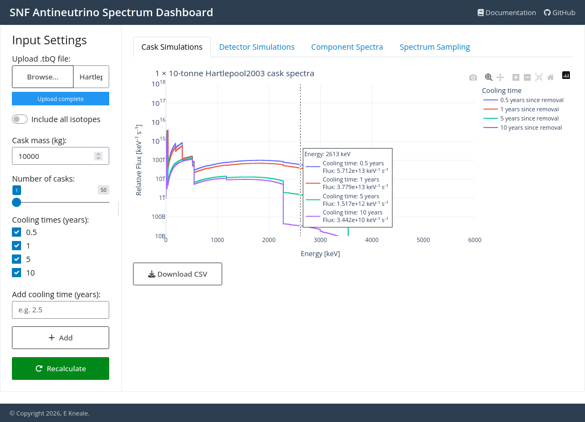
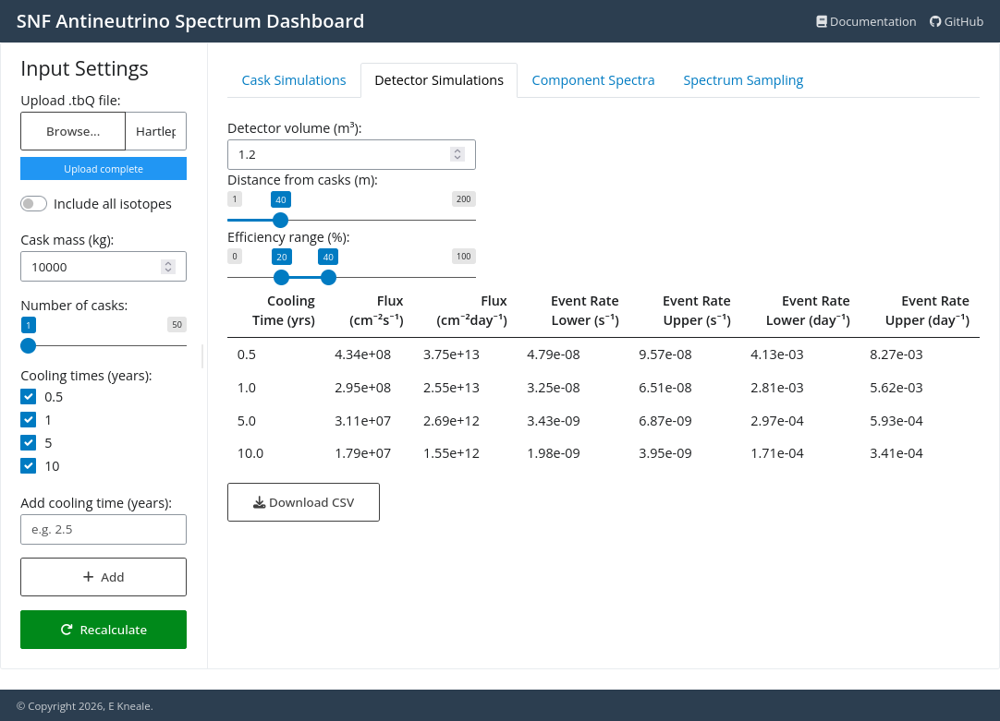
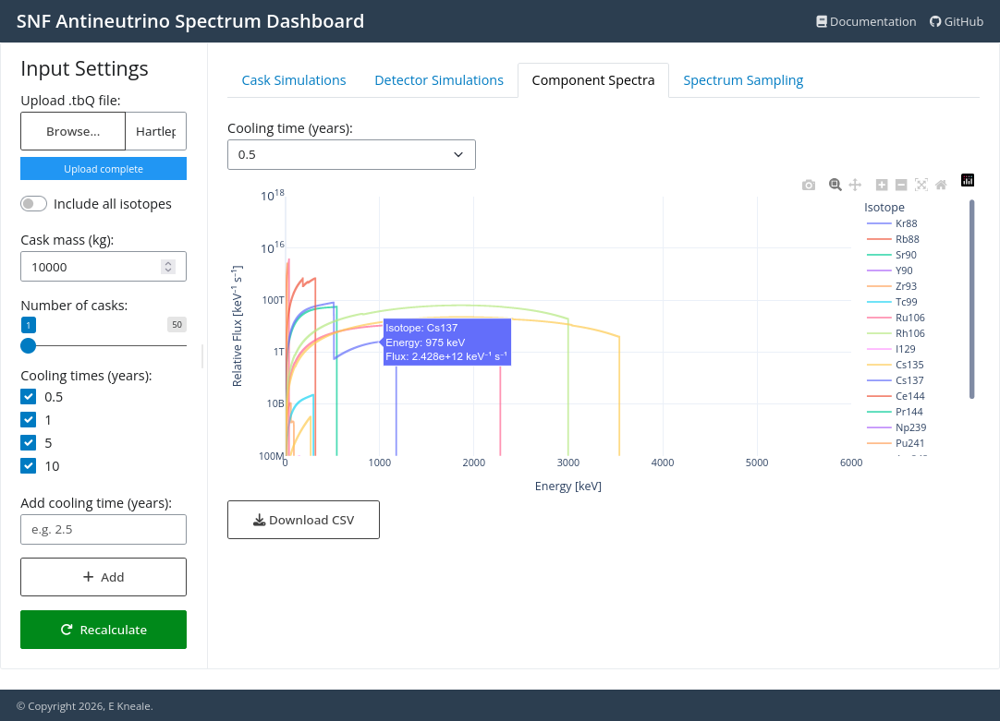
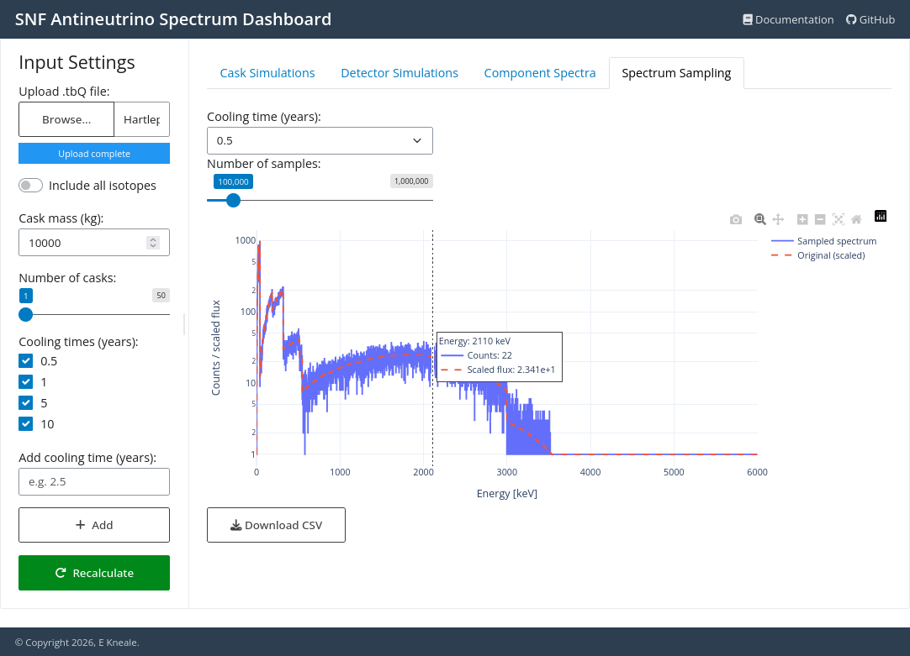

# The SNF dashboard

This page provides an overview of the SNF dashboard, which is a web-based interface for visualizing and analyzing SNF simulation results. The dashboard is built using the [Shiny for Python](https://shiny.posit.co/py/) framework and provides interactive plots, tables, and controls for exploring the data.

To launch the dashboard, run the following command in your terminal:

```bash
snf-dashboard
```

This will start the dashboard server. To view the dashboard, open a web browser and navigate to the address given by the server (the default is `http://localhost:8000`). You should see the main dashboard interface, which includes options for uploading data, setting the simulation parameters, and visualizing results.

## Input Settings

On the sidebar on the left, you can upload a FISPIN `.tbQ` file containing the isotope masses to include in the simulation (see  [the Cask documentation](cask.ipynb#creating-a-cask-from-a-fispin-simulation-file) for more details). On startup an example `.tbQ` file is loaded as a demonstration.

:::{note}
By default only 16 common isotopes are included in the simulation. The "Include all isotopes" toggle instead switches to including all isotopes in the input file, which is more computationally expensive. This only has an effect when a new file is uploaded, as the default example only includes the basic 16 isotopes.
:::

You can also set the mass and number of casks to simulate, and the cooling times to consider. Cooling times can be selected using the checkboxes, and new cooling times can be added by typing a new value in the input box and clicking the "Add Cooling Time" button. Note that cooling times must be entered in years, and can't be less than the input time step of the simulation (see [the Cask documentation](cask.ipynb#simulating-the-spectrum-at-different-cooling-times) again for more details).

Once the simulation settings are adjusted, click the "Recalculate" button to update the plots and results.

## Cask Simulations tab



The first tab to open shows the output of the cask simulation. The main plot will show the antineutrino spectrum at the selected cooling times. A CSV file containing the plotted spectra can be downloaded using the button below.

## Detector Simulations tab



The second tab runs a simulation of a detector observing the casks at the given cooling times. The detector volume, distance and efficiency bounds can be adjusted using the controls at the top. The table below shows the total flux in the simulated detector, along with calculated event rates.

## Component Spectra tab



The third tab shows the spectra of the individual isotopes in the simulation, for the cooling time selected in the dropdown menu. This allows you to see which isotopes are contributing most to the overall spectrum at different cooling times. Note isotopes can be toggled on and off using the legend on the right of the plot, and hovering over the plot will show the isotope name and flux at that energy.

By default only the 16 most common isotopes are shown, but if the "Include all isotopes" toggle is enabled then all isotopes in the input file will be included in this plot.

## Spectrum Sampling tab



The final tab runs a simulation of sampling the total spectrum at a given cooling time, with the number of samples entered using the slider. The simulated counts are shown on the plot, with the original spectrum overlaid for comparison.
